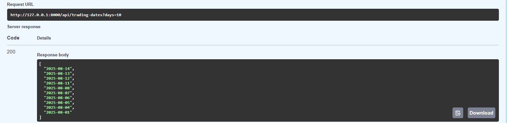
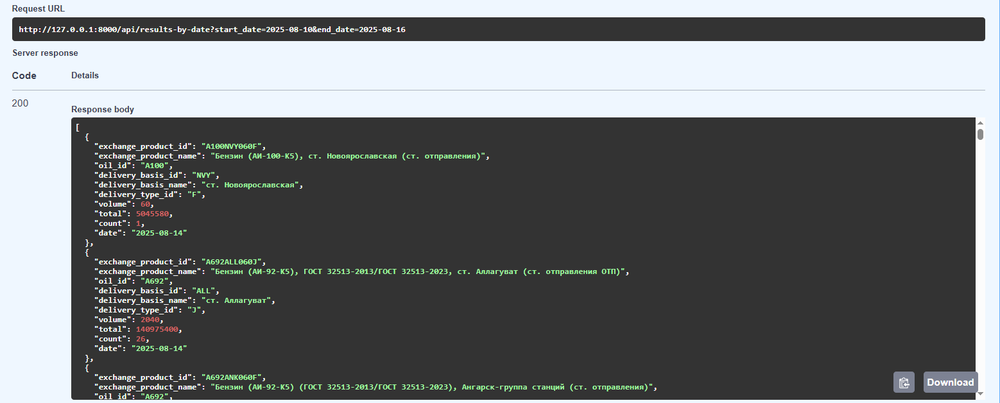
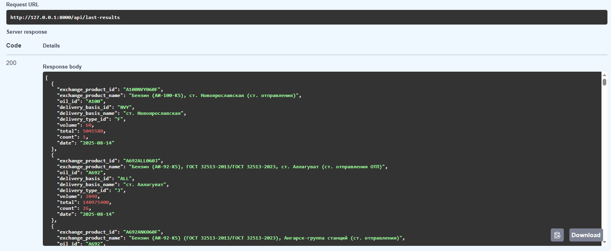
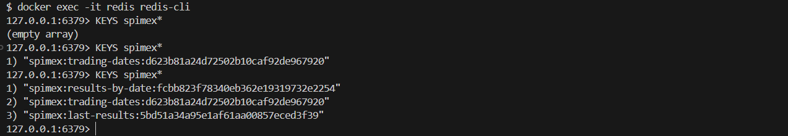

## Сервис реализованный на FastAPI для доступа к итогам торгов Секции «Нефтепродукты» СПбМТСБ
Приложение самостоятельно **не создаёт таблицу БД PostgreSQL**, а использует уже наполненную парсером [**SPIMEX Async Parser**](https://github.com/KuznetcovIvan/asyncio-section).

---

### Реализовано:
- эндпоинты:
    - со списком дат последних торговых дней (с фильтрацией по кол-ву последних торговых дней);
    - со списком торгов за заданный период (с фильтрацией по oil_id, delivery_type_id, delivery_basis_id, start_date, end_date);
    - со списком последних торгов (с фильтрацией по oil_id, delivery_type_id, delivery_basis_id);
- кеширование запросов (Redis);
- ежедневный сброс кэша в `14:11`.
---

### Установка и запуск:
1. Клонировать репозиторий 
- `git clone https://github.com/KuznetcovIvan/fastapi-section.git`
2. Перейти в корневую директорию проекта
- `cd fastapi-section`
3. Создать и активировать виртуальное окружение
- `python -m venv venv`
- `source venv/bin/activate`  (Linux / macOS)
- `venv\Scripts\activate `    (Windows)
4. Установить зависимости
- `pip install -r requirements.txt`
5. Создать файл с переменными окружения (.env)
- образец в [`.env.example`](.env.example).
6. Запустить сервис в режиме разработки
- `uvicorn app.main:app --reload`

---

### Документация доступна по URL:
- Swagger UI
[`http://127.0.0.1:8000/docs`](http://127.0.0.1:8000/docs)
- ReDoc
[`http://127.0.0.1:8000/redoc`](http://127.0.0.1:8000/redoc)

---

### Для работы требуется:
- запущенный PostgreSQL **с заполненной таблицей** данными торгов;
- запущенный Redis для кеширования.

---

### Стек:
- PostgreSQL  
- Redis  
- FastAPI  
- Uvicorn  
- Pydantic  
- SQLAlchemy + asyncpg  
- fastapi-cache2  
- APScheduler

---

### Пример работы:

